---

copyright:
  years: 2021
lastupdated: "2021-07-14"

subcollection: discovery-data
content-type: tutorial
account-plan: plus
completion-time: 2h

---

{:shortdesc: .shortdesc}
{:external: target="_blank" .external}
{:new_window: target="_blank"}
{:deprecated: .deprecated}
{:important: .important}
{:note: .note}
{:tip: .tip}
{:pre: .pre}
{:codeblock: .codeblock}
{:screen: .screen}
{:javascript: .ph data-hd-programlang='javascript'}
{:java: .ph data-hd-programlang='java'}
{:python: .ph data-hd-programlang='python'}
{:swift: .ph data-hd-programlang='swift'}
{:gif: data-image-type='gif'}
{:step: data-tutorial-type='step'}

# Getting answers from existing help content
{: #tutorial-convo}
{: toc-content-type="tutorial"}
{: toc-completion-time="2h"}

In this tutorial, you will use the {{site.data.keyword.discoveryshort}} and {{site.data.keyword.conversationshort}} services to create a virtual assistant that can answer questions about COVID-19 with information from the Center for Disease Control website.
{: shortdesc}

 **{{site.data.keyword.cloud_notm}} only**

Follow this tutorial only if you are using a managed deployment.
{:note}

## Learning objectives
{: #tutorial-convo-objectives}

By the time you finish the tutorial, you will understand how to:

- Create a Conversational Search project in {{site.data.keyword.discoveryshort}}.
- Add a web crawl data source to your {{site.data.keyword.discoveryshort}} project.
- Create a search skill in {{site.data.keyword.conversationshort}} that connects to your {{site.data.keyword.discoveryshort}} project.
- Deploy an assistant that can return answers that it retrieves from the website.

### Duration
{: #tutorial-convo-duration}

This tutorial will take approximately 2 to 3 hours to complete.

### Prerequisite
{: #tutorial-convo-prereqs}

1.  Before you begin, you must set up a paid account with IBM Cloud.

    You can complete this tutorial at no cost by using a Plus plan, which offers a free 30-day trial. However, to create a Plus plan instance of the service, you must have a paid account (where you provide credit card details). For more information about creating a paid account, see [Upgrading your account](/docs/account?topic=account-upgrading-account){: external}.

1.  Create a Plus plan {{site.data.keyword.discoveryshort}} service instance.

    Go to the [{{site.data.keyword.discoveryshort}} resource](https://cloud.ibm.com/catalog/services/watson-discovery){: external} page in the {{site.data.keyword.cloud_notm}} catalog and create a Plus plan service instance.

If you decide not to continue using the Plus plan and don't want to pay for it, delete the Plus plan service instance before the 30-day trial period ends.
{: important}

## Create the Conversational Search project
{: #tutorial-convo-project}
{: step}

Create a project. You'll create a Conversational Search project type. This type is optimized for retrieving answers during dialog-driven interactions. For example, unlike other project types, it does not apply prebuilt enrichments that aren't needed.

For more information about project types, see [Creating projects](/docs/discovery-data?topic=discovery-data-projects).

1.  From the {{site.data.keyword.discoveryshort}} Plus plan service page in {{site.data.keyword.cloud_notm}}, click **Launch {{site.data.keyword.discoveryshort}}**.
1.  From the *My Projects* page, click **New Project**.
1.  Name your project `Tutorial project`, and then click the **Conversational Search** tile.

    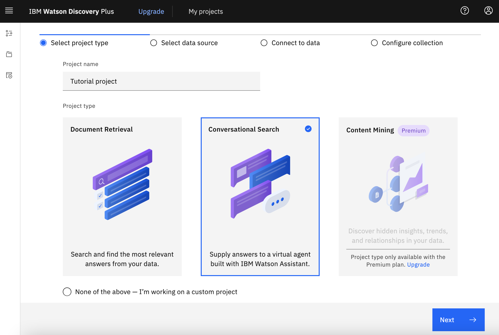
1.  Click **Next**.

You'll configure the data source for the project in the next step.

## Connect to a website
{: #tutorial-convo-add-data}
{: step}

We want the virtual assistant that we will build to be able to answer questions about COVID-19, so we will connect our project to a website that is hosted by the Center for Disease Control to address common questions about the virus.

1.  From the *Select data source* page, click **Web crawl**, and then click **Next**.

    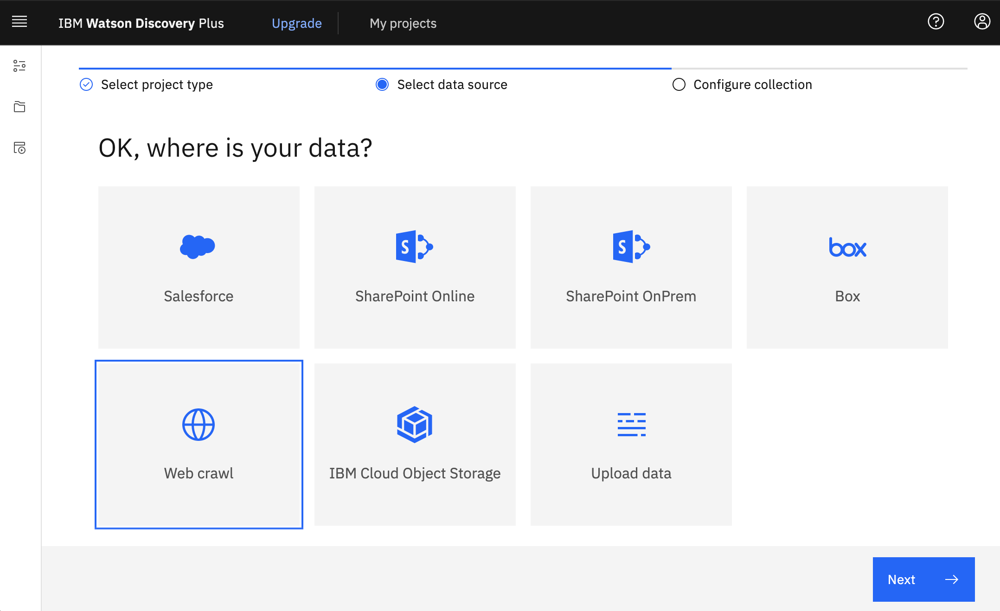
1.  In the **Collection name** field, add `COVID FAQ`.

    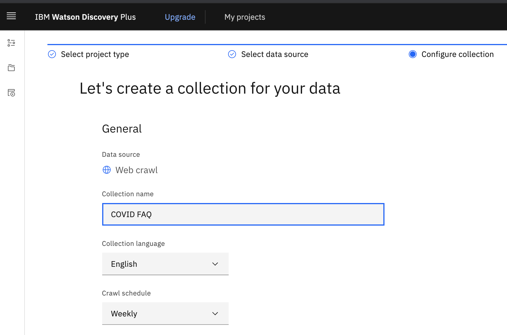
1.  In the **Starting URLs** field, add the following URL:

    ```
    https://www.cdc.gov/coronavirus/2019-ncov/faq.html
    ```
    {: codeblock}

    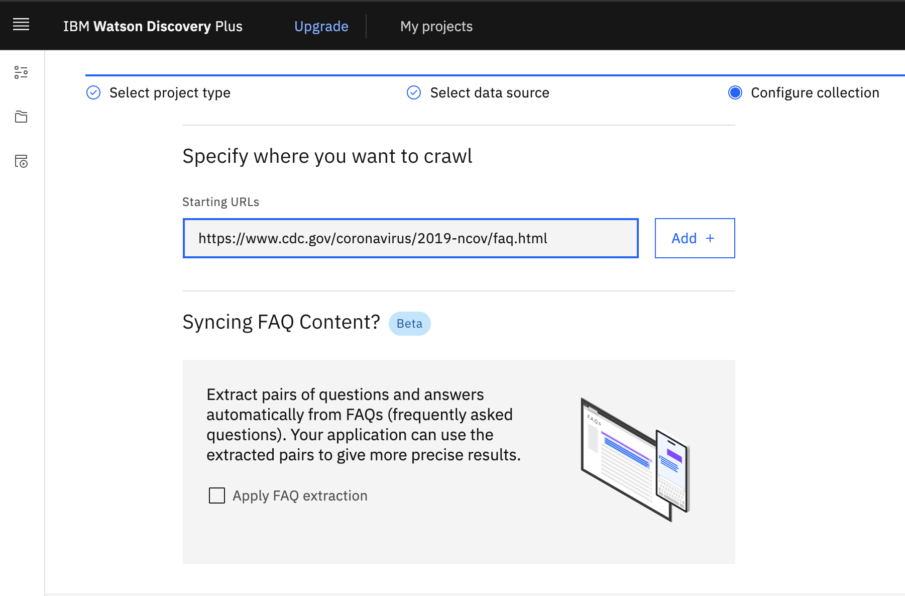

    In a real scenario, you might add a URL for a web page on your own website that covers FAQ information.
1.  Click **Add**.

    You will add only one starting URL. In a real scenario, you might add multiple URLs that go to other pages with information about the same topic. By adding more URLs, you can expand the breadth of the expertise of your assistant.

1.  Click the Edit icon for the URL that you just added.

    
1.  In the **Maximum number of links to follow** field, change the value to 0, and then click **Save**.

    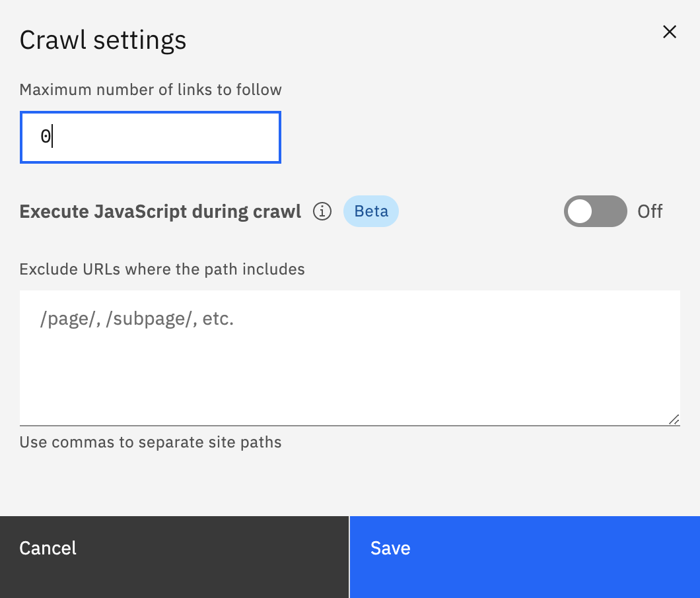

    By changing the value to 0, you indicate that you want the service to process only the page that you specified in the starting URLs field. Typically, the service would crawl the initial page and any pages that are linked to from the initial page.
1.  Click **Apply FAQ extraction**.
1.  Click **Finish**.

The service crawls the web page that you specified as the starting URL. Because you enabled FAQ extraction, for each question-and-answer pair that the service finds, it creates a new document. Each document contains two fields, a `title` field that contains the question from the pair, and a `text` field that contains the answer.

While the website is being crawled and the data indexed, you can create your {{site.data.keyword.conversationshort}} service instance.

## Create an assistant
{: #tutorial-convo-assistant}
{: step}

Both Lite or Trial plan {{site.data.keyword.conversationshort}} service instances are available at no cost. You will create a Trial plan because a Plus or higher plan is required to add a Search skill to an assistant. The Trial plan gives you access to features that are available with the Plus plan. The Lite plan doesn't.

1.  Open a new web browser page.

    Keep the {{site.data.keyword.discoveryshort}} project open in a separate tab so you can switch between the two applications.
1.  Create a Trial plan {{site.data.keyword.conversationshort}} service instance.

    Go to the [{{site.data.keyword.conversationshort}} resource](https://cloud.ibm.com/catalog/services/watson-assistant){: external} page in the {{site.data.keyword.cloud_notm}} catalog and create a Trial plan service instance.

    Create the instance in the same location as the {{site.data.keyword.discoveryshort}} service instance is hosted.
1.  From the {{site.data.keyword.conversationshort}} Plus plan service page in {{site.data.keyword.cloud_notm}}, click **Launch {{site.data.keyword.conversationshort}}**.
1.  An assistant and skill might be created for you automatically. If so, exit the assistant and go to the main Assistants page.

    You can click the Assistants icon from the navigation pane to get to the main Assistants page.

    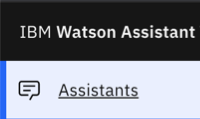

1.  Click **Create assistant**.
1.  In the **Name** field, add `Tutorial assistant`, and then click **Create assistant**.

For more information about assistants, see [Plan your assistant](/docs/assistant?topic=assistant-assistants).

## Test your project
{: #tutorial-convo-test}
{: step}

Let's go back to {{site.data.keyword.discoveryshort}} and check if the web crawl has finished.

1.  Return to the web browser tab that is open to {{site.data.keyword.discoveryshort}}.
1.  After the website has been crawled and the data processed, the *Improve and customize* page is displayed. The page mimics a chatbot interface with a field where you can enter a question.

    If the crawl is not completed and you want to check the progress, go to the Activity page. From the navigation pane, click **Manage collections**, and then click to open the COVID FAQ collection. The collection should contain over 80 documents. After the crawl is completed, go to the *Improve and customize* page.
1.  On the *Improve and customize* page, from the *Improvement tools* panel, expand **Customize display**, and then click **Search results**.
1.  Select **Field** instead of Passages as the source of result content, and then select `text` as the field to retrieve. Click **Apply**.

    For most searches, returning passages is the best choice. But remember, when you enable FAQ extraction, the answers from any question-and-answer pairs that are found are added to the `text`field in each resulting document. You want only the answer from the `text` field to be returned.
1.  In the *Type something* field, enter `How does the virus spread?` as the question.

    The response that is returned is the same answer to the question that is displayed in the FAQ entry on the website.

    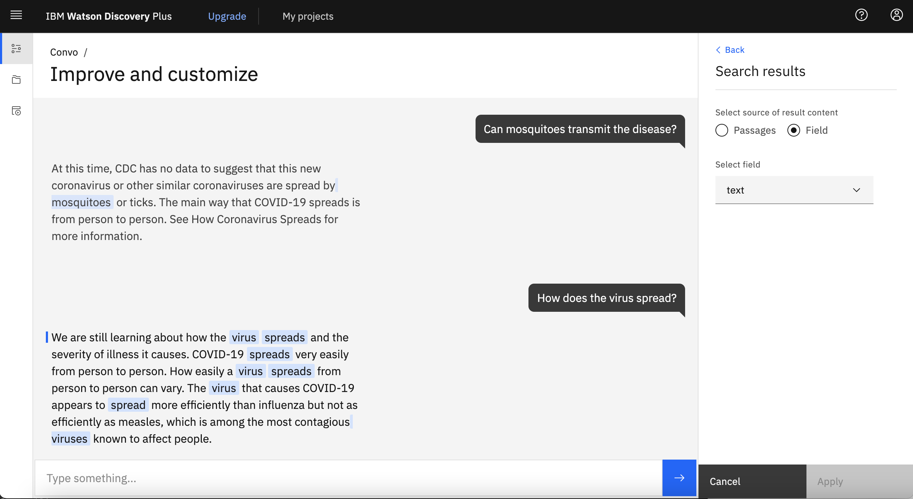

1.  You can ask other questions to test whether the appropriate answers are returned.

Congratulations! Your project is answering questions successfully. It's ready to be connected to an assistant.

## Add a search skill to your assistant
{: #tutorial-convo-search-skill}
{: step}

To connect your assistant to your {{site.data.keyword.discoveryshort}} project, you add a search skill.

1.  Return to the web browser tab that is open to {{site.data.keyword.conversationshort}}.
1.  From the overview page for the assistant that you created, scroll down to the Search section, and then click **Add search skill**.

    

1.  In the **Name** field, add `COVID answers`, and then click **Continue**.

    
1.  Select the Discovery instance where your project is stored. 
1.  Select the tutorial project with the COVID FAQ collection, and then click **Next**.

    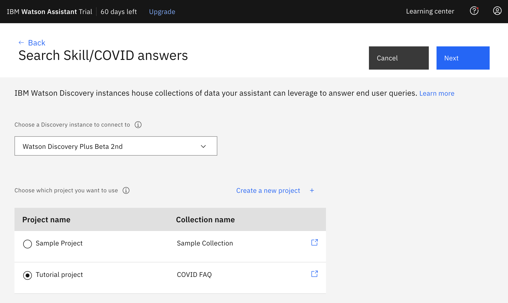
1.  The default result content configuration uses the best fields; you don't need to change them.

    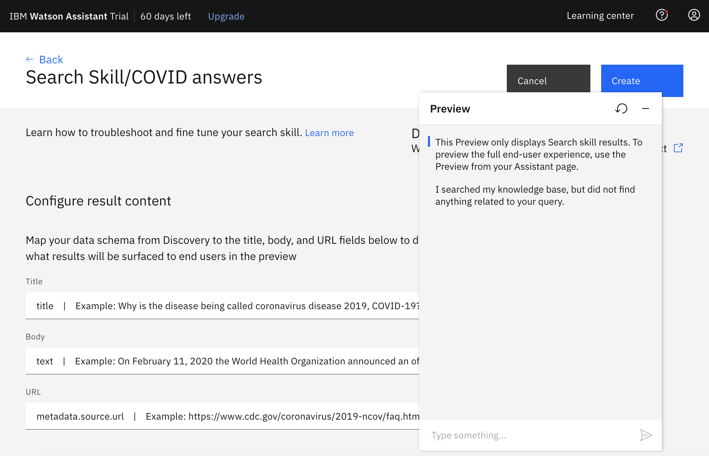
1.  Scroll to the *Emphasize the answer* section, and then set the switcher to **On**.

    

1.  Note that the *Adjust result quantity* section is set to return 3 results. 

    You could limit the number of results that are displayed to just 1 because you know each question has a paired answer. But, to do so would limit insightful information that might get returned by the assistant otherwise. The assistant evaluates the confidence of each possible response. It might find an answer that is better than the paired answer or that has a slightly different meaning that will better address the user's question.

    In the *Adjust result quantity* section, change the number to `2`. With this value, you can see what other suggestions are made by the assistant and the results are easier to read when there are two instead of three.
1.  In the *Preview* window, ask the same question that you asked to test the project in {{site.data.keyword.discoveryshort}}: `How does the virus spread?`

    Two responses are displayed. The exact answer is shown highlighted before the full passage is displayed.

    

1.  Click **Create**.

For more information about search skills, see [Adding skills to your assistant](/docs/assistant?topic=assistant-skill-add#skill-add-search-skill).

## Test the search skill
{: #tutorial-convo-test-chat}
{: step}

1.  From the assistant overview page, click **Preview**.
1.  Enter the test question: `How does the virus spread?`

    The correct answers are returned.

    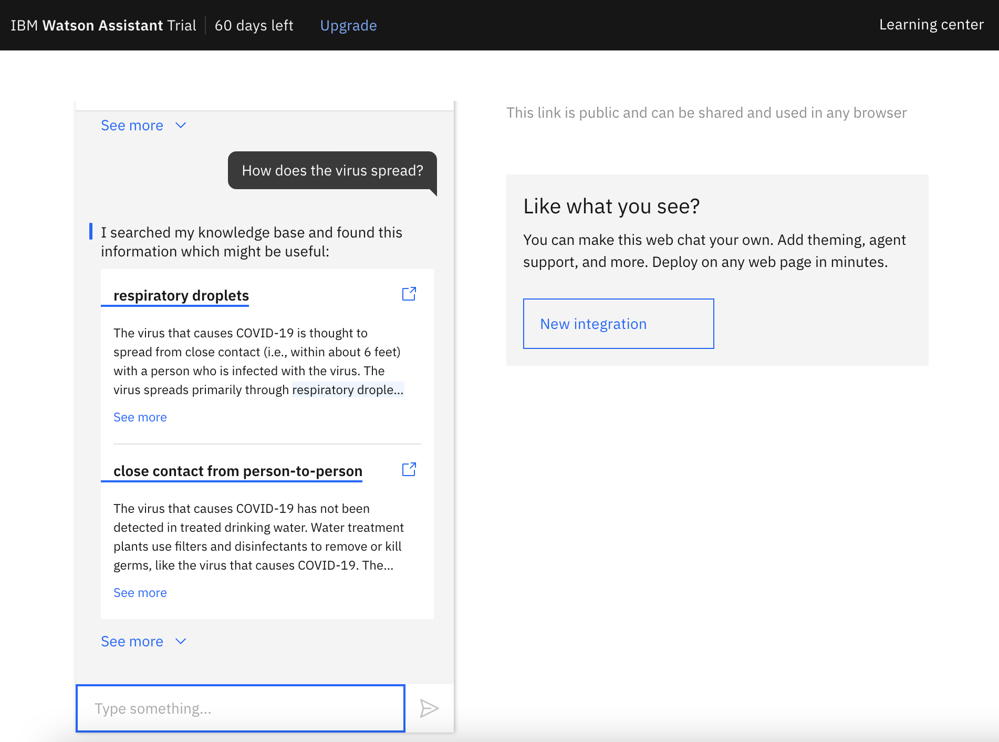

## Deploy your answer-finding virtual assistant
{: #tutorial-convo-deploy-chat}
{: step}

You will deploy your virtual assistant as a web chat integration. You can create the integration and then embed it on your own web page. 

There are other ways to deploy your assistant. We are using the web chat integration because it is quick and easy to set up. For more information about other deployment options, see [Deploying your assistant](/docs/assistant?topic=assistant-deploy-overview){: external}. 

1.  From the Preview page, click **New integration** to create a web chat integration.
1.  Click **Create**.
1.  Open the *Home Screen* tab, and then replace the conversation starters with the following questions:

    - What is COVID-19?
    - Who is at increased risk?
    - When should I seek emergency care?
1.  Click **Save and exit**.
1.  Reopen the web chat by clicking the **Web chat** tile in the *Integrations* section.

    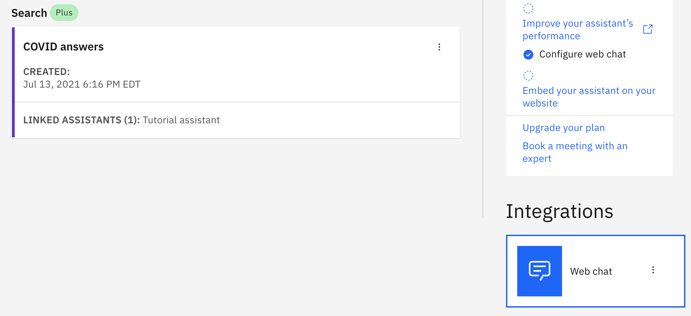
1.  Open the *Embed* tab, and then copy the script.
1.  In a text editor, create a new file, and then add the following HTML content to it:

    ```html
    <html>
    <head></head>
    <body>
        <title>My Test Page</title>
        <p>The body of my page.</p>
        <!-- copied script elements -->
        </body>
    </html>
    ```
    {: codeblock}

1.  Paste the embed script that you copied from the web chat integration into the HTML body.
1.  Save the HTML content as a file named `test.html`.
1.  Right-click the `test.html` file, and then open it in a web browser.
1.  Click the chat icon to open the web chat window.

    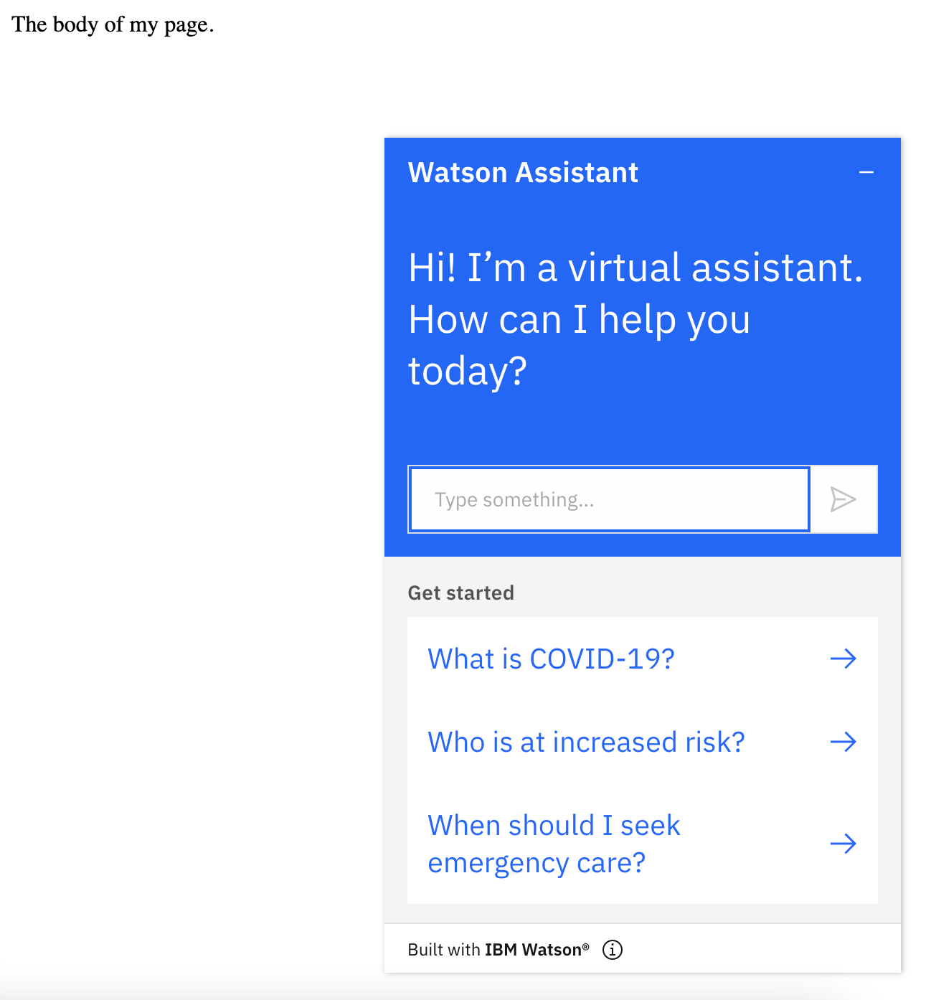
1.  Enter the test question in the *Type something* field: `How does the virus spread?`

    The correct answers are returned.

### Next steps
{: #tutorial-convo-next}

You can follow similar steps to create a Conversational Search project that you can use in production. Note that the *FAQ extraction* and *Emphasize the answer* features are beta features currently. Be sure to test your project thoroughly before you deploy it. If, during testing, you decide that you want a specific answer to be returned every time a specific question is asked, you can hard code the answer. Work with a developer to use the Curation API. For more information, see [Curations](/docs/discovery-data?topic=discovery-data-curations).